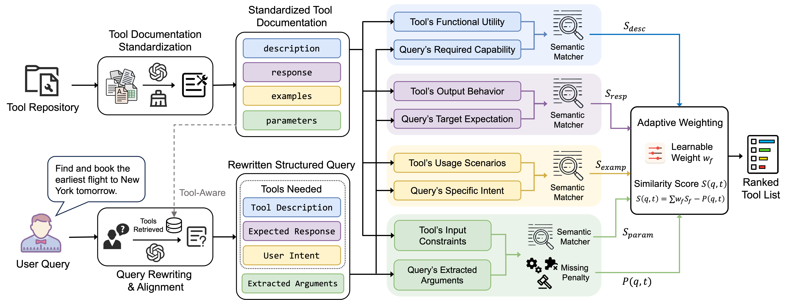

# Multi-Field Tool Retrieval 

Welcome to the Official Repository of **Multi-Field Tool Retrieval**!

## 📖 Overview

Integrating external tools enables Large Language Models (LLMs) to interact with real-world environments and solve complex tasks. Given the growing scale of available tools, effective tool retrieval is essential to mitigate constraints of LLMs' context windows and ensure computational efficiency. Existing approaches typically treat tool retrieval as a traditional ad-hoc retrieval task, matching user queries against the entire raw tool documentation.

We identify three fundamental challenges that limit the effectiveness of this paradigm: 
1. the incompleteness and structural inconsistency of tool documentation; 
2. the significant semantic and granular mismatch between user queries and technical tool documents; 
3. the multi-aspect nature of tool utility, that involves distinct dimensions, such as functionality, input constraints, and output formats, varying in format and importance.

Multi-Field Tool Retrieval (MFTR) framework is designed to align user intent with tool representations through fine-grained, multi-field modeling:

+ 📋 **Standardized Documentation** — Normalizes heterogeneous tool documentation into a unified structure
+ 🔄 **Query Rewriting** — Aligns user queries with tool documentation representations
+ ⚖️ **Adaptive Weighting** — Dynamically balances contributions of different documentation fields



## 📂 Project Structure

```plain
multi-field-tool-retrieval/
├── dataset/
│   ├── from_toolret/          # Raw source data
│   ├── augmented_tools/       # Standardized tool documentation
│   ├── rewritten_queries/     # Rewritten queries
│   ├── train_and_test/        # Processed Train/test splits
│   └── hard_negatives/        # BM25 sampled hard negatives
├── prompts/                   # Prompt templates for LLM
├── src/
│   ├── augment_tools.py       # Tool documentation standardization
│   ├── query_rewrite.py       # Query rewriting and alignment
│   ├── prepare_data.py        # Data preparation and negative sampling
│   └── weight/                # Adaptive weighting module
└── weight/                    # Pre-trained model weights
```

The `dataset/from_toolret` directory contains data downloaded from [ToolRet](https://huggingface.co/datasets/mangopy/ToolRet-Queries). Each dataset contains two files: `queries.json` and`tools.json`. To evaluate additional datasets, simply create a new dataset folder under dataset/from_toolret and place the corresponding queries.json and tools.json files in the same format.

## 🚀 Quick Start

### Environment Setup

Clone the repository and set up the environment:

```bash
conda create -n mftr python=3.10.19
conda activate mftr
pip install -r requirement.txt
```

Create a `.env` file in the project root to configure your paths and API keys:

```bash
CURRENT_PATH=/path/to/your/project
OPENAI_API_KEY=your_openai_api_key
```

### Reproduction

If you want to reproduce the results reported in the paper without running the full data processing pipeline, we provide pre-processed data (located in `dataset/augmented_tools`, `dataset/rewritten_queries`, etc.) and trained weights (located in `weight/`).

You can run the inference command directly:

```bash
python -m src.weight.inference_only --dataset {dataset} --retriever {retriever} --retriever_batch_size {batch_size}
```

Examples:

```bash
python -m src.weight.inference_only --dataset toolbench --retriever BAAI/bge-large-en-v1.5 --retriever_batch_size 16
```

Results will be saved to: `output/reproduction/{dataset}/{retriever}__{batch_size}/`

## 🛠 Full Pipeline

To run MFTR on a new dataset, you can follow the steps below.

### Step 1: Tool Documentation Standardization

Normalize raw tool documentation into a unified schema. Prompts for this step can be found in the `prompts/` directory. Use the following command to run the standardization:

```bash
python -m src.augment_tools --dataset {dataset}
```

The standardized documents will be stored in the file `dataset/augmented_tools/{dataset}/{LLM}_tools.json`.

### Step 2: Query Rewriting and Alignment

Align user queries with tool representations using the tool-oriented rewriting pipeline. The prompt for this step can be found in the file `prompts/query_rewrite.yaml`. Use the following command to run the query rewriting:

```bash
python -m src.query_rewrite --dataset {dataset}
```

The rewritten queries will be stored in `dataset/rewritten_queries/{dataset}/{your_setting}/queries.json`.

### Step 3: Prepare Training Data

Generate train/test splits using 5-fold cross-validation and mine hard negatives with BM25 for adaptive weighting. Use the following command to prepare the data:

```bash
python -m src.prepare_data --dataset {dataset}
```

The training and testing data will be saved in the `dataset/train_and_test/{dataset}/` directory, and hard negatives for each query will be stored in `dataset/hard_negatives/{dataset}/`.

### Step 4: Run MFTR (Training & Inference)

Train the adaptive weighting model and evaluate the retrieval performance.

```bash
python -m src.weight.main --dataset {dataset} --retriever {retriever_name} --retriever_batch_size {batch_size}
```

The results will be saved in the `output/weighted_field_retrieval/{your_setting}/{dataset}/{retriever_name}__{batch_size}/` directory.

Each runnable script contains a set of configurable parameters, which can be found and adjusted directly within the file.

## Credits

Part of the code is adapted from [tool-retrieval-benchmark](https://github.com/mangopy/tool-retrieval-benchmark).
